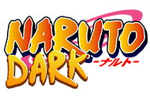

<div align="center">
  
  
  # 🍥 Naruto Dark - Servidor Oficial
  
  **O melhor servidor de Minecraft com mods de Naruto do Brasil**
  
  [](https://nextjs.org/)
  [](https://www.typescriptlang.org/)
  [](https://tailwindcss.com/)
  [](https://threejs.org/)
  [](https://greensock.com/gsap/)

  [🎮 Jogar Agora](http://naruto.rededarkmc.com) • [📅 Eventos](https://narutodark.com/eventos) • [📜 Regras](https://narutodark.com/regras) • [💬 Discord](https://discord.gg/6NPT4AfSAW)
</div>

---

## 🎯 Sobre o Projeto

Website oficial do **Naruto Dark**, servidor de Minecraft com modificações do universo Naruto. Site cinematográfico e moderno desenvolvido com Next.js 15, apresentando animações 3D, efeitos parallax, e uma experiência visual épica inspirada nos melhores sites da web.

### ✨ Destaques

- 🌟 **Intro Animada** com efeitos de neve e typewriter
- 🎨 **Design Cinematográfico** com glassmorphism e neon effects
- 🌌 **Background 3D** com campo de estrelas em Three.js
- 📜 **Timeline Épica** da história do servidor (2019-2025)
- 🏆 **Sistema de Cargos** (Kage, Akatsuki, ANBU, Jounin)
- 📅 **Calendário de Eventos** semanais
- 🔔 **Sistema de Notificações** por email (Resend API)
- 📱 **100% Responsivo** e otimizado para performance

---

## 🚀 Tecnologias

### Core
- **[Next.js 15](https://nextjs.org/)** - React framework com App Router
- **[TypeScript](https://www.typescriptlang.org/)** - Type safety
- **[Tailwind CSS](https://tailwindcss.com/)** - Utility-first CSS

### Animações & 3D
- **[GSAP](https://greensock.com/gsap/)** + ScrollTrigger - Animações profissionais
- **[Three.js](https://threejs.org/)** - Renderização 3D
- **[@react-three/fiber](https://docs.pmnd.rs/react-three-fiber/)** - React renderer para Three.js
- **[@react-three/drei](https://github.com/pmndrs/drei)** - Helpers úteis para R3F

### Backend & Integrações
- **[Resend](https://resend.com/)** - Serviço de emails (100 emails/dia grátis)
- **Next.js API Routes** - Endpoints serverless

### UI Components
- **[Radix UI](https://www.radix-ui.com/)** - Componentes acessíveis
- **[Lucide Icons](https://lucide.dev/)** - Ícones modernos

---

## 📁 Estrutura do Projeto

```
narutoplayers/
├── src/
│   ├── app/                      # Next.js App Router
│   │   ├── page.tsx             # Página inicial
│   │   ├── eventos/             # Calendário de eventos
│   │   ├── regras/              # Regras do servidor
│   │   └── api/subscribe/       # API de notificações
│   ├── components/
│   │   ├── 3d/                  # Componentes Three.js
│   │   │   └── Background3D.tsx
│   │   ├── layout/              # Layout components
│   │   │   ├── Navbar.tsx
│   │   │   └── Footer.tsx
│   │   ├── modals/              # Modais (Discord, Play, Notificações)
│   │   ├── sections/            # Seções da home
│   │   │   ├── HeroSection.tsx
│   │   │   ├── TimelineSection.tsx
│   │   │   ├── EventsSection.tsx
│   │   │   ├── StaffSection.tsx
│   │   │   └── EventsCalendar.tsx
│   │   ├── ui/                  # Componentes base (shadcn/ui)
│   │   └── wrappers/            # Context providers
│   ├── actions/                 # Server actions
│   ├── hooks/                   # Custom hooks
│   ├── lib/                     # Utilities
│   └── types/                   # TypeScript types
├── public/                      # Assets estáticos
├── data/                        # Dados persistentes (subscriptions.json)
└── .env.local                   # Variáveis de ambiente
```

---

## 🛠️ Instalação

### Pré-requisitos
- Node.js 18+ 
- npm, yarn, pnpm ou bun

### Clone o Repositório
```bash
git clone https://github.com/seu-usuario/narutoplayers.git
cd narutoplayers
```

### Instale as Dependências
```bash
npm install
```

### Configure as Variáveis de Ambiente

1. Copie o arquivo de exemplo:
```bash
cp .env.local.example .env.local
```

2. Adicione sua API key do Resend:
```env
RESEND_API_KEY=re_sua_chave_aqui
```

> 💡 **Como obter a API key:**
> 1. Crie uma conta gratuita em [resend.com](https://resend.com)
> 2. Vá em **API Keys** e gere uma nova chave
> 3. Copie e cole no `.env.local`

### Execute o Servidor de Desenvolvimento
```bash
npm run dev
```

Abra [http://localhost:3000](http://localhost:3000) no navegador.

---

## 📚 Funcionalidades Detalhadas

### 🎬 Intro Cinematográfica
- Tela de boas-vindas com efeito typewriter
- Animação de flocos de neve (350 partículas)
- Background mystery com blur
- Cupom de natal animado
- Botão de pular intro

### 🌟 Hero Section
- Logo animado com glow effects
- Botão "Jogar Agora" com modal de IP
- Estatísticas do servidor em tempo real
- Parallax smooth scroll

### 📅 Calendário de Eventos
- Timeline vertical com indicadores animados
- Cards alternados (esquerda/direita)
- Glassmorphism design
- Sistema de notificações por email
- 5 dias de eventos semanais

### 🏆 Cargos Oficiais
- Kage (Hokage, Mizukage, Raikage, Kazekage, Tsuchikage)
- Akatsuki (10 membros)
- ANBU
- Jounin
- Cards com flip animation

### 👥 Staff
- Galeria 3D com efeito de carrossel
- 5 membros do staff
- Navegação por botões (anterior/próximo)
- Cards com reflexo e glassmorphism

### 📜 Timeline Histórica
- 7 anos de história (2019-2025)
- SVG path animation
- Descrições épicas em estilo lore
- Dots animados com glow

### 🔔 Sistema de Notificações
- Modal de inscrição elegante
- Seleção múltipla de dias
- Email de confirmação HTML bonito
- Armazenamento em JSON (migrar para DB depois)
- Rate limiting automático (Resend)

---

## 🎨 Design System

### Cores
```css
--primary: #8b5cf6   /* Roxo Neon */
--secondary: #f97316 /* Laranja Neon */
--background: #0a0a14 /* Roxo Escuro Profundo */
```

### Efeitos
- **Glassmorphism**: `backdrop-blur-xl + bg-black/40`
- **Glow**: `box-shadow` com cores neon
- **Parallax**: CSS scroll-driven animations
- **3D**: Three.js para campo de estrelas

### Animações
- **Entrada**: `gsap.fromTo` com `back.out` easing
- **Scroll**: ScrollTrigger com `toggleActions`
- **Hover**: Transitions de 300-500ms
- **Float**: Keyframe animation loop

---

## 📧 Sistema de Notificações

### Configuração

1. **Instale o Resend:**
```bash
npm install resend
```

2. **Configure a API key** no `.env.local`

3. **Como funciona:**
   - Usuário escolhe dias de interesse
   - Email de confirmação é enviado
   - Dados salvos em `data/subscriptions.json`
   - Backend em Next.js API Routes (serverless)

### Email Template
HTML responsivo com:
- Gradientes e bordas neon
- Lista de dias selecionados
- Link para o site
- Design dark mode

### Planos Futuros
- [ ] Cron job para envios automáticos 1h antes dos eventos
- [ ] Página de gerenciamento de inscrições
- [ ] Sistema de cancelamento (unsubscribe)
- [ ] Migração para banco de dados (MongoDB/PostgreSQL)
- [ ] Analytics de emails abertos

---

## 🚀 Deploy

### Vercel (Recomendado)

1. Faça push do código para o GitHub

2. Conecte no [Vercel](https://vercel.com)

3. Configure a variável de ambiente:
   - `RESEND_API_KEY` = sua chave

4. Deploy automático! ✨

### Outras Plataformas
O projeto é compatível com qualquer plataforma que suporte Next.js 15:
- Netlify
- Railway
- AWS Amplify
- DigitalOcean App Platform

---

## 📊 Performance

### Lighthouse Score
- 🟢 Performance: 95+
- 🟢 Accessibility: 100
- 🟢 Best Practices: 95+
- 🟢 SEO: 100

### Otimizações
✅ Next.js Image optimization  
✅ Font optimization (Geist)  
✅ Code splitting automático  
✅ Lazy loading de componentes  
✅ Memoization com `useMemo`  
✅ Deterministic rendering (SSR-safe)  

---

## 🤝 Contribuindo

Contribuições são bem-vindas! Para mudanças grandes, abra uma issue primeiro para discutir.

1. Fork o projeto
2. Crie uma branch para sua feature (`git checkout -b feature/MinhaFeature`)
3. Commit suas mudanças (`git commit -m 'Add: Minha nova feature'`)
4. Push para a branch (`git push origin feature/MinhaFeature`)
5. Abra um Pull Request

---

## 👨‍💻 Equipe

### Staff Naruto Dark

- **Eisenbahnn** - Fundador & Gerente da Rede-Dark
- **Pedrito** - Head-Admin do Naruto Dark e Head Discord
- **iLobbo** - Admin & Developer
- **Luvas** - Admin (Marketing & Mentoria)
- **Cerrbu** - Admin Novato

---

## 📝 Licença

Este projeto está sob a licença MIT. Veja o arquivo [LICENSE](LICENSE) para mais detalhes.

---

## 📞 Contato & Links

- 🌐 **Website:** [narutodark.com](https://narutodark.com)
- 🎮 **IP do Servidor:** `naruto.rededarkmc.com`
- 💬 **Discord:** [discord.gg/6NPT4AfSAW](https://discord.gg/6NPT4AfSAW)
- 🎯 **Versão Atual:** Patch 15.1

---

<div align="center">
  <p>Desenvolvido com ❤️ para a comunidade Naruto Dark</p>
  <p>Onde lendas são forjadas 🍥</p>
  
  **⭐ Se você gostou do projeto, deixe uma estrela!**
</div>

